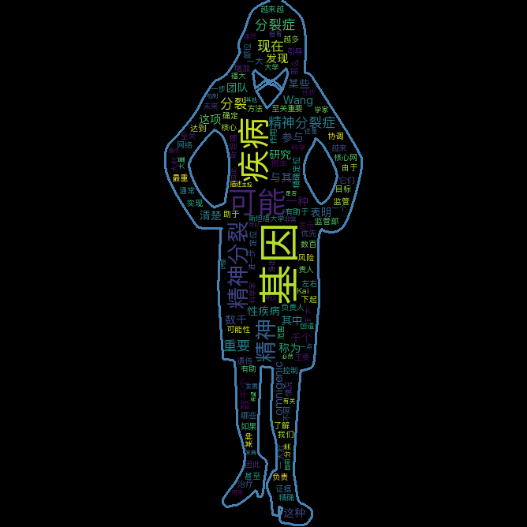

# 词云wordCloud docker教程

## 1. 普通用法
- `https://github.com/mojocn/wordCloudDocker.git && cd wordCloudDocker`
- python 启动 Flask `cd code && python3 app.py`

```bash
zhouqing1@zhouqing1-l5 MINGW64 ~/PycharmProjects/wordCloudWithDocker/code (master)
$ python app.py
 * Serving Flask app "app" (lazy loading)
 * Environment: production
   WARNING: This is a development server. Do not use it in a production deployment.
   Use a production WSGI server instead.
 * Debug mode: off
 * Running on http://127.0.0.1:8111/ (Press CTRL+C to quit)
```

## 2. build & run
```bash
# image 名称位worldcloud
docker build -t worldcloud https://github.com/mojocn/wordCloudDocker.git
# run docker image
docker run -d -p 8111:8111 worldcloud
```

## 3. API文档
```bash
curl --request POST \
  --url http://localhost:8111 \
  --header 'Accept: */*' \
  --header 'Accept-Encoding: gzip, deflate' \
  --header 'Cache-Control: no-cache' \
  --header 'Connection: keep-alive' \
  --header 'Content-Type: multipart/form-data; boundary=--------------------------538173031025591472896753' \
  --header 'Host: localhost:8111' \
  --header 'content-type: multipart/form-data; boundary=----WebKitFormBoundary7MA4YWxkTrZu0gW' \
  --form 'content=精神分裂症的遗传可能性很高--概率可能达到80%左右。现在，越来越多的证据表明，一大批不同基因可能参与其中。

这项新研究的负责人Kai Wang表示：“由于数百甚至数千个基因可能会增加患精神分裂症的风险，因此了解哪些是最重要的基因是至关重要的，它们在疾病中协调着核心网络。精确定位主要监管部位可能有助于引导我们在未来实现新治疗方法的优先目标。”

由单基因控制的疾病通常被称为单基因疾病。而如果是某些基因被发现在某种情况下起作用时那么则被称为多基因。2017年，斯坦福大学的一个科学家团队进一步扩大了基因分类范围并由此创造了omnigenic一词--用来描述可能跟数千个基因有关的性状或疾病。

现在这项新的研究表明，虽然目前还不清楚精神分裂症是一种多基因性疾病还是omnigenic性疾病，但有一点非常清楚的是，这种疾病的发展有大量基因参与其中。Wang指出，在这种疾病的最终发病机制中，某些基因必然比其他基因更重要，所以他的团队希望发现是否可以识别出一种主控基因。

' \
  --form gender=man
```


```python
import requests

url = "http://localhost:8111"

payload = "------WebKitFormBoundary7MA4YWxkTrZu0gW\r\nContent-Disposition: form-data; name=\"content\"\r\n\r\n精神分裂症的遗传可能性很高--概率可能达到80%左右。现在，越来越多的证据表明，一大批不同基因可能参与其中。\n\n这项新研究的负责人Kai Wang表示：“由于数百甚至数千个基因可能会增加患精神分裂症的风险，因此了解哪些是最重要的基因是至关重要的，它们在疾病中协调着核心网络。精确定位主要监管部位可能有助于引导我们在未来实现新治疗方法的优先目标。”\n\n由单基因控制的疾病通常被称为单基因疾病。而如果是某些基因被发现在某种情况下起作用时那么则被称为多基因。2017年，斯坦福大学的一个科学家团队进一步扩大了基因分类范围并由此创造了omnigenic一词--用来描述可能跟数千个基因有关的性状或疾病。\n\n现在这项新的研究表明，虽然目前还不清楚精神分裂症是一种多基因性疾病还是omnigenic性疾病，但有一点非常清楚的是，这种疾病的发展有大量基因参与其中。Wang指出，在这种疾病的最终发病机制中，某些基因必然比其他基因更重要，所以他的团队希望发现是否可以识别出一种主控基因。\n\n\r\n------WebKitFormBoundary7MA4YWxkTrZu0gW\r\nContent-Disposition: form-data; name=\"gender\"\r\n\r\nman\r\n------WebKitFormBoundary7MA4YWxkTrZu0gW--"
headers = {
    'content-type': "multipart/form-data; boundary=----WebKitFormBoundary7MA4YWxkTrZu0gW",
    'Accept': "*/*",
    'Cache-Control': "no-cache",
    'Host': "localhost:8111",
    'Content-Type': "multipart/form-data; boundary=--------------------------538173031025591472896753",
    'Content-Length': "1483",
    'Connection': "keep-alive",
    'cache-control': "no-cache"
    }

response = requests.request("POST", url, data=payload, headers=headers)

print(response.text)
```

## 4. 图片导出




## 5. selenium + chrome-driver 网页截图

| 接口 | 说明 |
| --- | --- |
| URI| :8111/ss |
| url-参数:u | url截图网址  |
| url-参数:i| id防止md5 url值重复  |
| HTTP-Response| image/png |